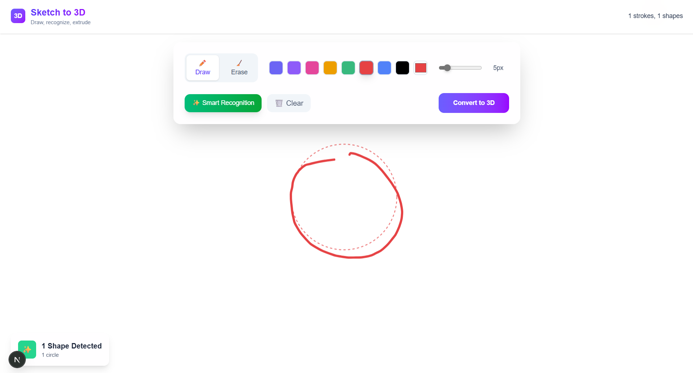
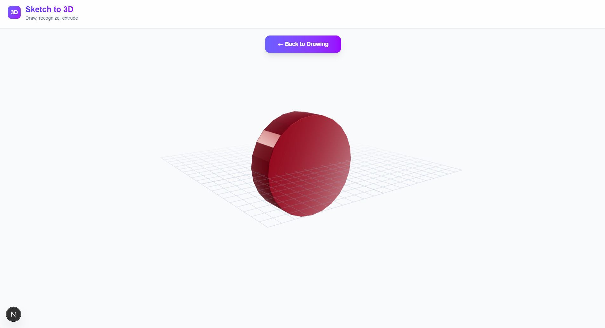
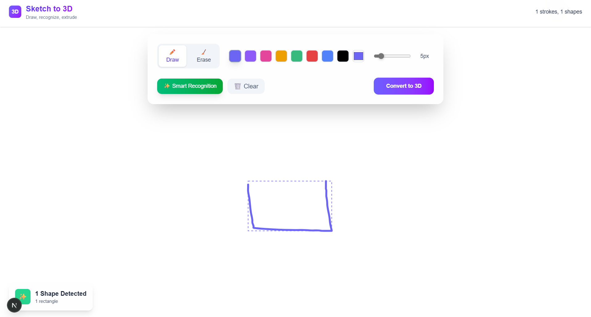
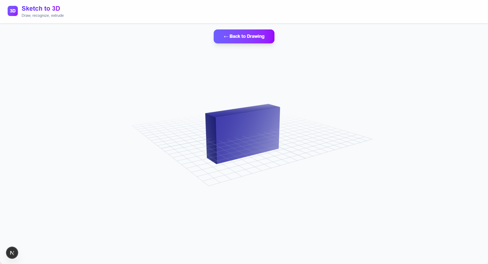

<div align="left">
    <div style="display: inline-block;">
    <h1 style="display: inline-block; vertical-align: middle; margin-top: 0;">Sketch To 3D</h1>
        
        <p><em>Draw in 2D, recognize shapes, and instantly extrude them into interactive 3D — right in your browser.</em></p>
    
    
    
    
  </p>
        <p>Built with:</p>
        <p style="margin:4px 0;">
      
      
      
      
      
      
    </p>
    </div>
</div>

<br clear="left"/>

---

<details><summary>📜 Table of Contents</summary>

- [📖 Overview](#-overview)
- [📸 Extension Screenshots](#-extension-screenshots)
- [✨ Features](#-features)
- [🛠️ Tech Stack](#%EF%B8%8F-tech-stack)
- [🚀 Quick Start](#-quick-start)
- [📁 Project Architecture](#-project-architecture)
- [🎮 Usage Examples](#-usage-examples)
- [🔮 Roadmap & Future Vision](#-roadmap--future-vision)
- [🤝 Join Our Community](#-join-our-community)
- [📄 License & Credits](#-license--credits)

</details>

---

## 📖 Overview

**Sketch to 3D** bridges the gap between imagination and creation. It's an innovative web application that transforms your simple 2D sketches into interactive 3D models in real-time. Whether you're a designer prototyping ideas, an educator teaching geometry, or just someone who loves to create, this tool makes 3D modeling accessible to everyone.

### 🌟 Why Choose Sketch to 3D?

- **🚀 Zero Learning Curve** — If you can draw, you can create 3D models
- **⚡ Instant Results** — See your sketches transform in real-time
- **🌐 Browser-Based** — No downloads, no installations, just pure creativity
- **🎨 Creative Freedom** — From simple shapes to complex polygons
- **🔧 Developer-Friendly** — Clean APIs and extensible architecture
- **🎓 Educational** — Perfect for learning 3D concepts and spatial reasoning

---

## 📸 Extension Screenshots

<div align="center">
  
  
  
  
</div>

---

## ✨ Features

<table>
<tr>
<td width="50%">

### 🎨 **Intuitive Drawing Experience**

- **Freehand Drawing** with natural pen tools
- **Smart Shape Recognition** for circles, rectangles, lines, and polygons
- **Responsive Canvas** that adapts to any screen size
- **Undo/Redo Support** for confident experimentation
- **Pressure Sensitivity** for tablets and stylus devices

</td>
<td width="50%">

### 🔮 **Real-Time 3D Magic**

- **Instant Extrusion** from 2D shapes to 3D objects
- **Interactive 3D Scene** with orbit controls and lighting
- **Live Preview** as you draw
- **Smooth Animations** powered by Three.js
- **Multiple Camera Angles** for better visualization

</td>
</tr>
<tr>
<td width="50%">

### 🛠️ **Professional Tools**

- **Clean API** with `getStrokes()`, `clearCanvas()`, `exportImage()`
- **Grid System** with snap-to-grid functionality
- **Pan & Zoom** independent of shape data
- **Memory Management** with automatic cleanup
- **Export Options** for various 3D formats

</td>
<td width="50%">

### 🎯 **Performance Optimized**

- **WebGL Acceleration** for smooth 3D rendering
- **Efficient Algorithms** for shape recognition
- **Responsive Design** across all devices
- **Progressive Enhancement** for older browsers
- **Memory Efficient** rendering pipeline

</td>
</tr>
</table>

---

## 🛠️ Tech Stack

<div align="center">

|                                                     Technology                                                      |    Purpose     |                 Why We Chose It                 |
| :-----------------------------------------------------------------------------------------------------------------: | :------------: | :---------------------------------------------: |
|             | **Framework**  |   Server-side rendering & optimal performance   |
|                   | **UI Library** | Component-based architecture & state management |
|    |  **Language**  |    Type safety & better developer experience    |
|          | **3D Engine**  |  Powerful WebGL abstraction & 3D capabilities   |
|                                      | **2D Canvas**  |   High-performance 2D graphics & interactions   |
|  |  **Styling**   |      Utility-first CSS & rapid prototyping      |

</div>

---

## 🚀 Quick Start

Get up and running in less than 3 minutes:

### Prerequisites

- **Node.js 18+** (Latest LTS recommended)
- **npm** or **yarn** package manager
- **Modern browser** with WebGL 2.0 support

### Installation

```bash
# Clone the repository
git clone https://github.com/AlexanderPotiagalov/Sketch3DConverter.git

# Navigate to project directory
cd Sketch3DConverter

# Install dependencies
npm install

# Start development server
npm run dev
```

🎉 **That's it!** Open `http://localhost:3000` and start sketching!

### Production Build

```bash
# Build for production
npm run build

# Start production server
npm start

# Or serve static files
npm run export && npx serve out/
```

---

## 📁 Project Architecture

Our codebase is organized for clarity and maintainability:

```
├── components
│   ├── DrawCanvas.tsx        # Konva-based drawing & shape recognition
│   └── ThreeView.tsx         # Three.js scene setup & extrusion logic
├── pages
│   ├── api
│   │   └── vectorize.ts      # Converts strokes/shapes to 3D specs
│   └── index.tsx             # Main UI: toolbar, canvas & 3D layers
├── utils
│   └── ShapeRecognizer.ts    # Stroke → RecognizedShape algorithm
├── public
│   └── assets                # Logo, example images, favicons
├── styles
│   └── globals.css           # Tailwind imports & custom overrides
├── README.md
├── LICENSE
├── .gitignore
├── .env.local
├── eslint.config.mjs
├── package.json
├── package-lock.json
├── tscongif.json
├── postcss.config.mjs
└── next.config.js            # Dynamic imports & SSR config
```

---

## 🎮 Usage Examples

### Basic Drawing API

```typescript
// Get reference to the drawing canvas
const canvasRef = useRef<DrawCanvasRef>(null);

// Clear the canvas
canvasRef.current?.clearCanvas();

// Export current drawing as image
const imageData = canvasRef.current?.exportImage("png", 0.9);

// Get all strokes for processing
const strokes = canvasRef.current?.getStrokes();

// Set drawing mode
canvasRef.current?.setTool("pen" | "eraser" | "select");
```

### Advanced Shape Recognition

```typescript
import { ShapeRecognizer } from "./utils/ShapeRecognizer";

const recognizer = new ShapeRecognizer({
  tolerance: 0.1,
  minPoints: 5,
  enableSmoothing: true,
});

const shapes = recognizer.analyzeStrokes(strokeData);
// Returns: Array<Circle | Rectangle | Line | Polygon | Ellipse>

// Advanced recognition with confidence scores
const detailedResults = recognizer.analyzeWithConfidence(strokeData);
// Returns: Array<{ type: string, confidence: number, geometry: Shape }>
```

### 3D Scene Integration

```typescript
import { ThreeScene } from "./components/ThreeView";

// Create 3D scene with custom settings
const scene = new ThreeScene({
  antialias: true,
  shadows: true,
  postProcessing: true,
});

// Add shapes to 3D scene
shapes.forEach((shape) => {
  const mesh = scene.addExtrudedShape(shape, {
    depth: 10,
    bevelEnabled: true,
    material: "phong",
  });
});

// Animate the scene
scene.animate(() => {
  // Custom animation logic
  mesh.rotation.y += 0.01;
});
```

---

## 🔮 Roadmap & Future Vision

We're always improving and exploring new possibilities:

- **🤖 Smarter AI** — Enhanced shape recognition and intelligent suggestions
- **🎨 Better Visuals** — Support for textures, lighting, and materials
- **📱 Mobile Friendly** — Seamless experience on phones and tablets
- **👥 Collaboration** — Real-time drawing with friends or teammates
- **🥽 Immersive Tech** — AR/VR support and 3D printing export options

---

## 🤝 Join Our Community

We believe great software is built by great communities:

<div align="center">

### 💬 **Get Involved**

[](https://github.com/AlexanderPotiagalov/Sketch3DConverter/discussions)
[](https://github.com/AlexanderPotiagalov/Sketch3DConverter/issues)
[](https://github.com/AlexanderPotiagalov/Sketch3DConverter/pulls)
[](https://discord.gg/sketch3d)

</div>

### Ways to Contribute

- 🐛 **Bug Reports** — Help us squash those pesky bugs
- 💡 **Feature Requests** — Share your brilliant ideas
- 🔧 **Code Contributions** — Submit pull requests
- 📚 **Documentation** — Improve our guides and tutorials
- 🎨 **Design & UX** — Enhance UI/UX and create assets
- 🗣️ **Community Support** — Help others in discussions
- 🎓 **Educational Content** — Create tutorials and examples

## 📄 License & Credits

<div align="center">

**Sketch to 3D** is open source and available under the [MIT License](LICENSE).

Built with modern web technologies and a passion for creativity.

---

### 👨‍💻 **Created with ❤️ by [Alexander Potiagalov](https://github.com/AlexanderPotiagalov)**

_Turning sketches into reality, one line at a time._

---

<p>
  
  
  
  
</p>

**⭐ Star this repo if you found it helpful!**

_Made with ✨ for creators, by creators_

</div>
